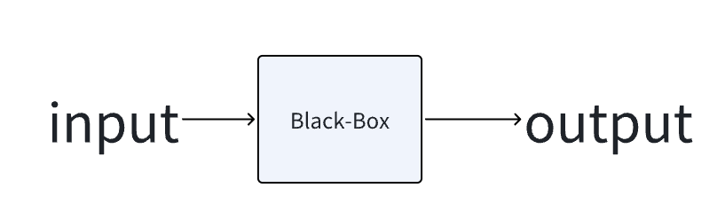
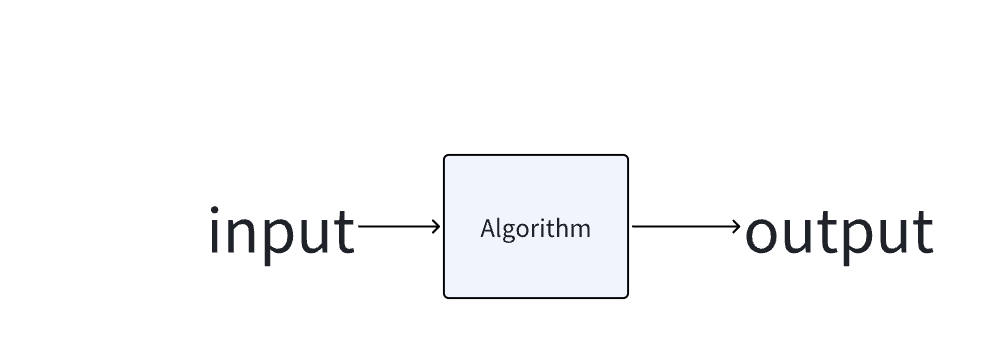

# Lectrue0 ComputationalThinking

## 计算机思想

1. 计算机是一个解决问题的机器

 1

## 二进制

1. 我们日常生活中的数字系统是十进制的 逢十进一
2. 计算机底层的数字系统是二进制的 逢二进一

2^0^ = 1  
2^1^ = 2  
2^2^ = 4  
2^3^ = 8  
2^4^ = 16  
2^5^ = 32  
2^6^ = 64  
2^7^ = 128  
2^8^ = 256  
2^9^ = 512  
2^10^ = 1024

### 二进制 单位

1. 1KB=1024B；1MB=1024KB=1024×1024B。

2. 1B（byte，字节）= 8 bit（见下文）；

3. 1KB（Kilobyte，千字节）=1024B= 10^3 B；

4. 1MB（Megabyte，兆字节，百万字节，简称“兆”）=1024KB= 10^6 B；

5. 1GB（Gigabyte，吉字节，十亿字节，又称“千兆”）=1024MB= 10^9 B；

6. 1TB（Terabyte，万亿字节，太字节）=1024GB= 10^12 B；

7. 1PB（Petabyte，千万亿字节，拍字节）=1024TB= 10^15 B；

8. 1EB（Exabyte，百亿亿字节，艾字节）=1024PB= 10^18 B；

9. 1ZB（Zettabyte，十万亿亿字节，泽字节）= 1024EB= 10^21 B；

10. 1YB（Yottabyte，一亿亿亿字节，尧字节）= 1024ZB= 10^24 B；

11. 1BB（Brontobyte，一千亿亿亿字节）= 1024YB= 10^27 B；

12. 1NB（NonaByte，一百万亿亿亿字节） = 1024BB = 10^30B；

13. 1DB（DoggaByte，十亿亿亿亿字节） = 1024 NB = 10^33 B；

### 二进制 符号位

0000 0000 表示一个字节  
在计算机存储时 一般将第一位表示为符号位置 0 为整数 1 为负数  
0000 0001 表示 1  
1000 0001 表示 -1

### 二进制计算

0000 0001 表示 1  
1000 0001 表示 -1  
但是在进行二进制计算时  
0000 0001 与 1000 0001 相加为 1000 0010  
结果为 -4 不是我们所期望的 0  
这说明当前的负数表示规则有所缺陷 ，不利于二进制计算

### 原码补码反码 ！！！

1. 源码：0000 0001
2. 反码：1111 1110
   1. 正数：与原码相同
   2. 负数：符号位为 1 数值部分为该数的绝对值的二进制逐位取反
3. 补码：1111 1111

   1. 正数：与源码相同
   2. 负数： 在反码的基础上+1

4. 补码 = 反码 + 0000 0001(这里指的是数字 1,不是源码，只是恰巧与源码相同)
5. 源码 + 补码 = 0 为什么等于 0 呢
   1. 因为 0000 0001 + 1111 1111 = 1 0000 0000
   2. 但是我们最大存储位为 8 位 1 溢出了 所以 1 0000 0000 变成了 0000 0000

### 二进制计算 levelup

源码 0000 0001 与 补码 1111 1111 进行二进制计算时 结果为 0  
因此 我们将补码作为源码的负数 这有利于二进制计算，  
此时需要更新我们脑海中的数字系统  
源码： 0000 0001 表示 1  
补码： 1111 1111 表示 -1

### 二进制数字表示范围

八位二进制可表示的数值范围：

0000 0000

1. 无符号位时 数据范围为 0 ~ 2^8^-1 (0 ~ 256)
2. 有符号位时 数据范围为 -2^7^ ~ 2^7^-1 (-128 - 127)

#### 负数的取值范围计算

从 1000 0000 到 1111 1111 即 -128 ~ -1

这里没弄懂 需要好好看一下 原码补码反码

### 二进制转换

## 字符集

[ASCII 码表](https://www.asciim.cn/)

1. ASCII 码
2. null 为 0000 0000
3. 0 为 0011 0000 十进制为 48 表示数字 0
4. A 为 0100 0001 十进制为 65 表示字符 A
5. a 为 0110 0001 十进制为 97 表示字符 a

### 常见字符集

1. ASCII
2. UTF-8
3. UTF-16
4. UTF-32
5. Unicode
6. ISO 8859
7. Windows 1252
8. GB2313、 GBK GB18030
9. shift JIS
10. EUC-KR

## 数字表达内容

1. 文字、图片、视频、音频 都是通过二进制一层有一层的抽象构成
2. 将数据(二进制)一层层的抽象构成了数据结构

## Algorithm

解决问题的过程

