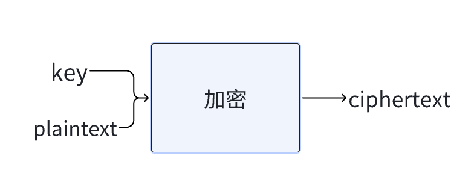

# Lecture 2 Array

## compiling

1. preprocessing
2. compiling
3. assembling
4. linking

## debug

1. 基本上所有的 IED 都有 debug

## 变量

boolean 1byte  
char 1byte  
int 4byte  
float 4byte  
long 8byte  
double 8byte  
string ?

## 内存

变量分配的内存空间是在真是存在的，

## 数组

一块连续的内存空间

## 字符串

其实是字符数组 由\0 结尾  
长度为三的字符串其实占了 4 个字节

## command-line argument

argv[]

## 密码学
