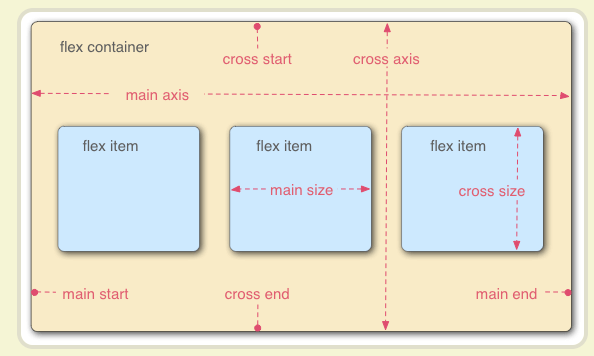

# FLEX 布局

传统的布局方案，基于盒子模型， 依赖 display 属性 + position 属性 + float 属性。它对于那些特殊布局非常不方便，比如，垂直居中就不容易实现。 2009 年，W3C 提出了一种新的方案----Flex 布局，可以简便、完整、响应式地实现各种页面布局。目前，它已经得到了所有浏览器的支持，这意味着，现在就能很安全地使用这项功能。

## 相关文档

1. [阮一峰](https://ruanyifeng.com/blog/2015/07/flex-grammar.html)
2. [菜鸟教程](https://www.runoob.com/w3cnote/flex-grammar.html)
3. [MDN](https://developer.mozilla.org/zh-CN/docs/Web/CSS/flex)

### 基本概念

主轴、侧轴(交叉轴)  
 
