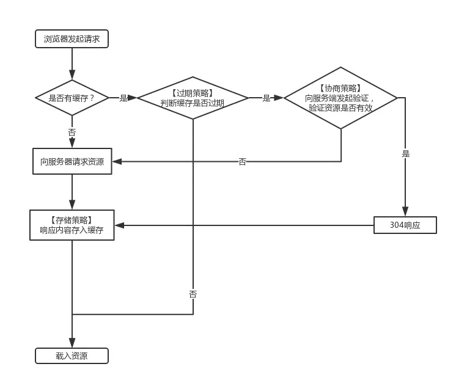
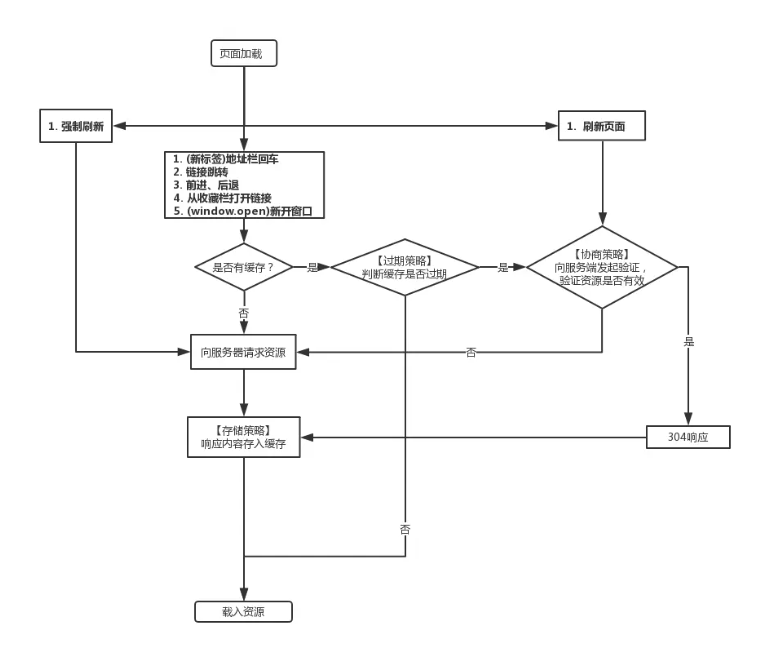
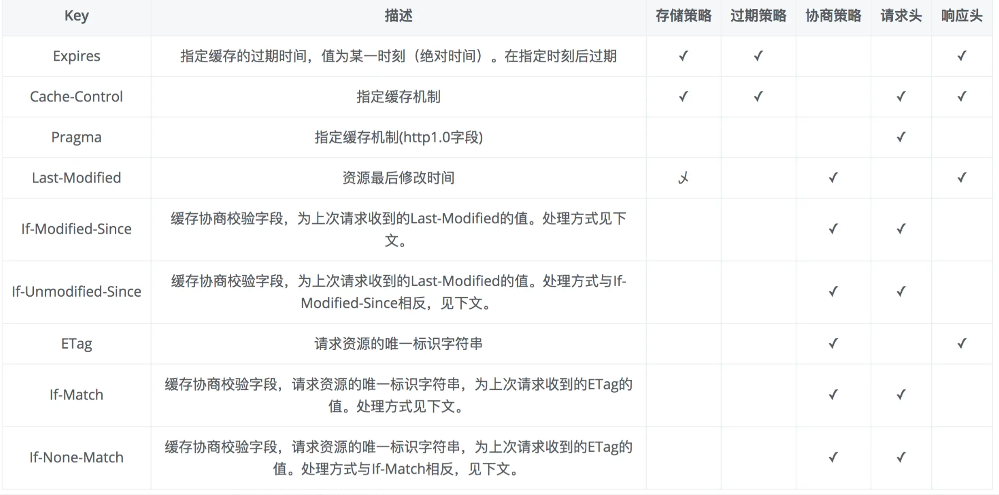

# 浏览器缓存策略之扫盲篇

1. 缓存基础
2. 缓存的判断策略
3. 各类缓存的优缺点
4. 缓存的最佳实践

## 缓存的判断策略

1.  三个策略
    - 过期策略，发生在请求前，用于判断缓存是否过期
    - 协商策略，发生在请求中，用于判断缓存是否更新
    - 存储策略，发生在请求后，用于决定是否缓存响应资

### 浏览器访问资源的 7 中方式

1. （新标签）地址栏回车
2. 链接跳转
3. 前进/后退
4. 从收藏栏打开链接
5. （window.open）新开窗口
6. 刷新（Command + R / F5）
7. 强制刷新 (Command + Shift + R/Ctrl + F5)

## 缓存基础

http 中关于缓存有关的字段

### 强缓存/弱缓存(协商缓存)

强弱缓存之间的主要区别在于获取资源时是否会发送请求。
